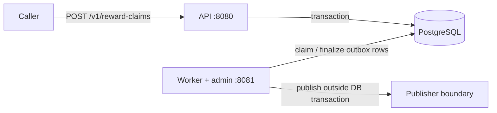

# Architecture

`game-rewards-service` is intentionally small: one API process, one worker process, and PostgreSQL as the durable consistency boundary.



The API and worker are separate operating-system processes and do not share in-memory state.

The current publisher is simulated. It exists to exercise the worker reliability model without introducing an external broker.

## Reward claim flow

For a valid `POST /v1/reward-claims` request, the service:

1. normalizes and validates the request and `Idempotency-Key`;
2. hashes the normalized key and accepted request;
3. starts a PostgreSQL transaction;
4. creates or loads the idempotency record;
5. enforces reward uniqueness with `UNIQUE (player_id, campaign_id, reward_id)`;
6. creates the reward claim and one `RewardClaimed` outbox event when the claim is new;
7. stores the deterministic response in the idempotency record;
8. commits the transaction.

The important invariant is:

> A committed new reward claim has both its completed idempotency response and its pending outbox event. If any required write fails, none of those writes commit.

The request transaction never calls an external publisher.

## Idempotency and duplicate prevention

The design deliberately separates client retry idempotency, business-level reward uniqueness, and asynchronous delivery. Each problem is enforced by a different mechanism.

**Client retries** use `Idempotency-Key`:

* same normalized key + same accepted request -> replay the stored response;
* same normalized key + different accepted request -> `409 idempotency_key_reused`;
* a visible committed idempotency record in `processing` state -> `409 idempotency_key_in_progress`.

**Business duplicates** use the database constraint:

```sql
UNIQUE (player_id, campaign_id, reward_id)
```

A different idempotency key cannot bypass that invariant. The resulting `409 reward_already_claimed` response is stored for deterministic replay under the key that produced it.

Raw idempotency keys are not persisted; PostgreSQL stores the operation and SHA-256 key hash.

## Transactional outbox and worker

A new claim writes one `RewardClaimed` outbox event in the same transaction as the claim and idempotency response.

The outbox remains aggregate-agnostic: `aggregate_id` is intentionally not a foreign key to `reward_claims`, keeping the event store decoupled from one domain table.

The worker then processes due events:

```text
pending -> processing -> published
                   \-> pending       retry scheduled
                   \-> dead_letter   max attempts reached
```

Claiming uses PostgreSQL `FOR UPDATE SKIP LOCKED` and a processing lease (`locked_by`, `locked_until`). The claim/update statement completes before publishing starts, so the worker does **not** hold a row lock or database transaction while calling the publisher.

Completion, retry, and dead-letter updates require the current lease owner. If a worker crashes or stalls until its lease expires, another worker can reclaim the event and stale finalization attempts are rejected.

The worker processes one event at a time per process. Additional worker processes can increase throughput while PostgreSQL coordinates claims.

## Delivery semantics

Delivery is **at-least-once**.

If publishing succeeds but the worker dies before persisting `published`, the lease eventually expires and the event can be delivered again. A real downstream consumer must therefore deduplicate by `event_id`.

Retries use bounded exponential backoff and PostgreSQL-calculated retry timestamps. After the configured maximum attempts, the event moves to `dead_letter`.

Shutdown cancellation is not persisted as a publisher failure: attempts are not incremented and no retry/dead-letter transition is written. The leased event becomes recoverable after lease expiry.

## Failure classification

Only explicitly recognized PostgreSQL availability failures are mapped to `503 service_unavailable`.

Schema, invariant, authentication, protocol, concurrency-control, and other unexpected database failures remain internal unless a specific domain mapping applies.

Low-level PostgreSQL and network details are not returned to clients.

## Observability model

The API and worker are separate processes with separate Prometheus registries:

* API: HTTP, reward-claim, and idempotency metrics on `:8080`;
* worker: HTTP and outbox metrics on the worker admin listener, `:8081` by default.

`/livez` checks process liveness only. `/readyz` checks required runtime readiness: PostgreSQL for the API, and PostgreSQL plus an active worker loop for the worker.

Metrics use bounded labels and do not query PostgreSQL during scrapes. Database-global queue depth and oldest-event gauges are intentionally absent rather than approximated with process-local counters.

## Key design choices

* **PostgreSQL over additional infrastructure:** transactions, uniqueness, idempotency state, outbox storage, and worker coordination fit the current scale without adding Kafka or Redis. The trade-off is that API consistency and outbox processing share PostgreSQL capacity and availability.
* **Explicit SQL over an ORM:** the important behavior depends on visible constraints, transactions, locking, and SQLSTATE handling.
* **Transactional outbox over external calls in the request transaction:** avoids dual-write inconsistency and long-lived request transactions.
* **At-least-once delivery over an exactly-once guarantee:** duplicate delivery across an external boundary is handled with stable event IDs and downstream deduplication.
* **Leases plus `SKIP LOCKED`:** `SKIP LOCKED` coordinates concurrent claims; durable leases provide crash recovery and stale-worker fencing after the claim transaction ends.
* **No scrape-time database metrics:** keeps metrics collection independent of PostgreSQL availability and avoids adding query load to every scrape.

These choices are deliberately proportional to the service. A real external broker, automated maintenance jobs, distributed tracing, or additional infrastructure should be introduced only when concrete requirements justify them.
