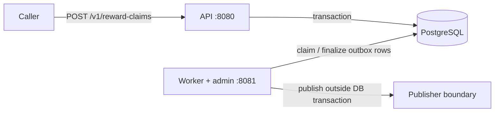

# Architecture

`game-rewards-service` is intentionally small: one API process, one worker process, and PostgreSQL as the durable consistency boundary.


```mermaid
flowchart LR
    C[Caller] -->|POST /v1/reward-claims| A[API :8080]
    A -->|transaction| P[(PostgreSQL)]
    W[Worker + admin :8081] -->|claim / finalize outbox rows| P
    W -->|publish outside DB transaction| X[Publisher boundary]
```

The API and worker are separate operating-system processes and do not share in-memory state.

The current publisher is simulated. It exists to exercise the worker reliability model without introducing an external broker.

## Reward claim flow

For a valid `POST /v1/reward-claims` request, the service:

1. normalizes and validates the request and `Idempotency-Key`;
2. hashes the normalized idempotency key;
3. starts a PostgreSQL transaction;
4. reserves the idempotency key or loads its stored response;
5. enforces reward uniqueness with `UNIQUE (player_id, campaign_id, reward_id)`;
6. creates the reward claim and one `RewardClaimed` outbox event when the claim is new;
7. stores the deterministic response in the idempotency record;
8. commits the transaction.

The important invariant is:

> A committed new reward claim has both its stored idempotency response and its pending outbox event. If any required write fails, none of those writes commit.

The request transaction never calls an external publisher.

## Idempotency and duplicate prevention

The design deliberately separates client retry idempotency, business-level reward uniqueness, and asynchronous delivery. Each problem is enforced by a different mechanism.

**Client retries** use `Idempotency-Key`:

* same normalized key + same accepted request -> replay the stored response while that idempotency record is retained;
* same normalized key + different accepted request -> `409 idempotency_key_reused` while that record is retained.

The idempotency row itself is the reservation while the reward-claim transaction is open. A successful transaction fills the deterministic response before commit; a committed row without a stored response is therefore an invariant failure and is surfaced as `500 internal_error`, not as a retryable client conflict.

Reward-claim transactions explicitly use PostgreSQL `READ COMMITTED`. The reservation insert uses the unique `key_hash` as the concurrency boundary; after a conflicting reservation resolves, replay reads the immutable stored response with an ordinary `SELECT` instead of taking an additional row lock.

**Business duplicates** use the database constraint:

```sql
UNIQUE (player_id, campaign_id, reward_id)
```

A different idempotency key cannot bypass that invariant. The resulting `409 reward_already_claimed` response is stored for deterministic replay under the key that produced it.

Replay retention is intentionally separate from request handling. Idempotency records with stored responses become eligible for routine cleanup 24 hours after `created_at`; request handling does not apply an expiry check, so a retained record continues to replay until it is deleted. After cleanup, the stored key-level replay and reuse history is gone and a subsequent request is evaluated against current business state.

The idempotency record stores the normalized `player_id`, `campaign_id`, and `reward_id` directly. Those fields are the request identity used to distinguish a replay from `idempotency_key_reused`; there is no separate canonical request fingerprint.

Stored response status and bytes are immutable replay state after the transaction commits. Replay validates the persisted envelope and that the stored body is still valid UTF-8 JSON, then returns those exact bytes without reinterpreting them through the current response struct. This keeps exact replay independent of later response-shape refactors while PostgreSQL constraints protect the allowed stored-response states.

Raw idempotency keys are not persisted; PostgreSQL stores only their SHA-256 hashes.

## Transactional outbox and worker

A new claim writes one `RewardClaimed` outbox event in the same transaction as the claim and idempotency response.

`RewardClaimed` schema v1 carries `schema_version`, `event_id`, `event_type`, `occurred_at`, and a `claim` object containing `claim_id`, `player_id`, `campaign_id`, `reward_id`, and `claimed_at`. It does not carry a separate claim status because claim existence and the `RewardClaimed` event type already express that state.

Reward claim and event timestamps are serialized as RFC 3339 UTC values; PostgreSQL `timestamptz` remains the persistent source of the underlying instant.

The outbox remains aggregate-agnostic: `aggregate_id` is intentionally not a foreign key to `reward_claims`, keeping the event store decoupled from one domain table.

The worker then processes due events:

```text
pending -> processing -> published
                   \-> pending       retry scheduled
                   \-> dead_letter   max failures reached
```

Claiming uses PostgreSQL `FOR UPDATE SKIP LOCKED` and a processing lease (`locked_by`, `locked_until`). The claim/update statement completes before publishing starts, so the worker does **not** hold a row lock or database transaction while calling the publisher.

Completion, retry, and dead-letter updates require the current lease owner. If a worker crashes or stalls until its lease expires, another worker can reclaim the event and stale finalization attempts are rejected.

The worker processes one event at a time per process. Additional worker processes can increase throughput while PostgreSQL coordinates claims.

## Delivery semantics

Delivery is **at-least-once**.

If publishing succeeds but the worker dies before persisting `published`, the lease eventually expires and the event can be delivered again. A real downstream consumer must therefore deduplicate by `event_id`.

Retries use bounded exponential backoff and PostgreSQL-calculated retry timestamps. `failed_attempts` records durably persisted publisher failures; after a publish failure reaches the configured maximum failures, the event moves to `dead_letter`. `last_failure_reason` retains the most recently persisted publisher failure classification, including after eventual publication, and is `NULL` exactly when `failed_attempts` is zero.

Shutdown cancellation is not persisted as a publisher failure: `failed_attempts` is not incremented and no retry/dead-letter transition is written. The leased event becomes recoverable after lease expiry.

## Failure classification

Only explicitly recognized PostgreSQL availability failures are mapped to `503 service_unavailable` on the API request path. Caller cancellation and caller deadlines remain standard context errors and are not reclassified as dependency failures.

The outbox worker uses the same fail-closed principle with process semantics appropriate for background work:

* recognized PostgreSQL availability failures, including the worker store's own query timeout, are recoverable iteration failures and are retried after the poll interval;
* publisher failures remain event-level outcomes and follow the persisted retry/backoff/dead-letter policy;
* persisted publisher failure reasons use the bounded `failed`, `timeout`, and `canceled` vocabulary;
* lease loss during finalization is an expected fencing outcome, recorded separately and left for normal lease recovery/reclaim;
* schema, permission, invariant, protocol, programming, and otherwise unexpected store failures are fatal to the worker loop so the process can terminate rather than report an active but permanently ineffective worker.

Caller/shutdown cancellation is preserved as context cancellation and is not counted as an outbox operation failure.

Low-level PostgreSQL and network details are not returned to clients or exposed through `outbox_worker_iteration_failed`; worker startup failures may still log their underlying error for diagnosis.

## Observability model

The API and worker are separate processes with separate Prometheus registries:

* API: HTTP, reward-claim, and idempotency metrics on `127.0.0.1:8080` by default for direct local runs;
* worker: HTTP and outbox metrics on the worker admin listener, `127.0.0.1:8081` by default for direct local runs.

`/livez` checks process liveness only. `/readyz` checks required runtime readiness: PostgreSQL for the API, and PostgreSQL plus an active worker loop for the worker. A fatal worker store failure stops that loop and triggers process shutdown; transient recognized availability failures do not create sticky readiness state from a single failed iteration.

Metrics use bounded labels and do not query PostgreSQL during scrapes. Database-global queue depth and oldest-event gauges are intentionally absent rather than approximated with process-local counters.

## Key design choices

* **PostgreSQL over additional infrastructure:** transactions, uniqueness, idempotency records, outbox storage, and worker coordination fit the current scale without adding Kafka or Redis. The trade-off is that API consistency and outbox processing share PostgreSQL capacity and availability.
* **Explicit SQL over an ORM:** the important behavior depends on visible constraints, transactions, locking, and SQLSTATE handling.
* **Transactional outbox over external calls in the request transaction:** avoids dual-write inconsistency and long-lived request transactions.
* **At-least-once delivery over an exactly-once guarantee:** duplicate delivery across an external boundary is handled with stable event IDs and downstream deduplication.
* **Leases plus `SKIP LOCKED`:** `SKIP LOCKED` coordinates concurrent claims; durable leases provide crash recovery and stale-worker fencing after the claim transaction ends.
* **No scrape-time database metrics:** keeps metrics collection independent of PostgreSQL availability and avoids adding query load to every scrape.

These choices are deliberately proportional to the service. A real external broker, automated maintenance jobs, distributed tracing, or additional infrastructure should be introduced only when concrete requirements justify them.
